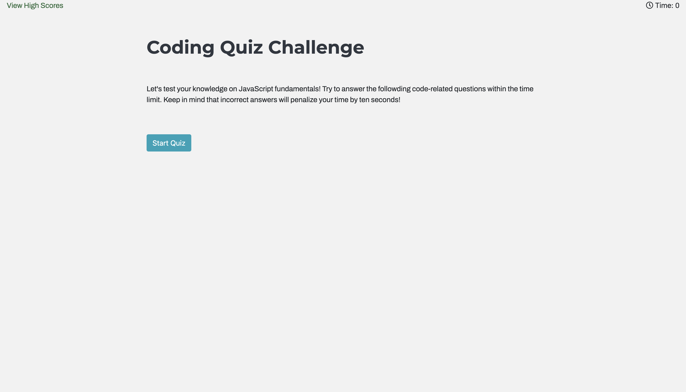

# Code Quiz

This is a timed coding quiz with multiple-choice questions.

## Instructions
1. Press "Start Quiz"
   There are 12 questions overall, and the timer in the top right corner will begin to count down.
   The "View High Scores" option in the upper left will take you to a list of all the most recent high scores.

2. Multiple-choice responses are provided for a sequence of questions.
   If the question is answered incorrectly, the timer will stop for 10 seconds. If the question is answered properly, the score will increase by 1. If a question is answered properly or incorrectly, it will be indicated at the bottom of the page. Will also display the right answer if it is incorrect.
  
3. The game is over when all questions have been answered or the timer hits zero.
   
4. The user can input their initials and score when the game is over, and then click "Submit" to store their high scores to local storage.
   
5. Next, a list of stored high scores will be displayed.
   
6. The user will then have the choice of clicking "Go Back" to retake the quiz or "Clear High Scores" to erase any previously recorded results.

## Features
* HTML
* CSS
* JavaScript
* Bootstrap

## Source Image
[Code Quiz Demo] 

## License
MIT
  

